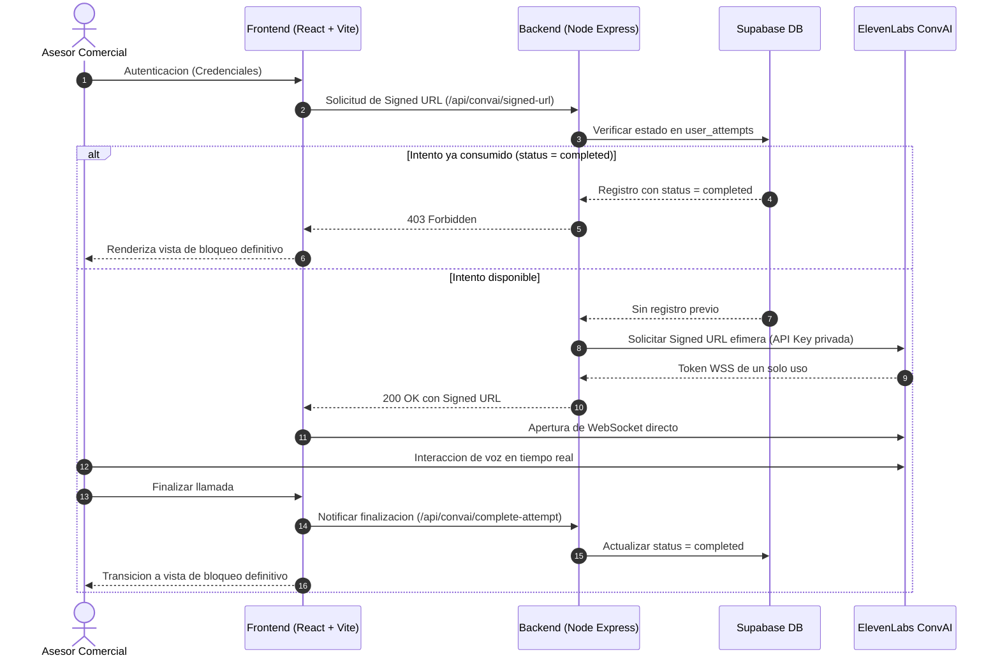

# Sales Training AI — Simulador de Ventas Claro Hogar

Plataforma de entrenamiento y evaluacion de habilidades comerciales basada en agentes conversacionales de voz en tiempo real, desarrollada con ElevenLabs Conversational AI, React 19, Three.js y Supabase.

El sistema funciona como un simulador interactivo de cliente residencial para Claro Hogar Colombia, evaluando el protocolo comercial, la resolucion de objeciones tecnicas y economicas, y el cierre de ventas bajo una restriccion estricta de un solo intento por usuario registrado.

---

## Arquitectura del Entorno de Simulacion

La interfaz esta estructurada como un entorno operativo de cabina (Cockpit) a pantalla completa (`100vh`), sin desplazamiento vertical, dividida en tres columnas principales:

```
+--------------------------------------------------------------------------------------------------+
|  [o] Sales Training AI [SIMULADOR CLARO]                 [User] Alex Thompson   [FINALIZAR]      |
+------------------------------+-----------------------------------+-------------------------------+
|    INSTRUCCIONES DEL RETO    |           HERO CENTRAL            |     TRANSCRIPCION EN VIVO     |
|                              |                                   |                               |
|  1. Manejo de objecion...    |         [ 3D WebGL Orb ]          |  +-------------------------+  |
|  2. Presentar beneficios...  |          (Cromo Perla)            |  | [Tu]              14:31 |  |
|  3. Cierre de prueba...      |                                   |  | Mensaje del asesor...   |  |
|                              |       |||||||||||||||||||||       |  +-------------------------+  |
|  +------------------------+  |       (Visualizador Audio)        |  +-------------------------+  |
|  | Escenario: Migracion a |  |                                   |  | [Cliente]         14:31 |  |
|  | plan Ilimitado...      |  |        [ Mute | Hangup ]          |  | Objecion del cliente... |  |
|  +------------------------+  |       (Control Flotante)          |  +-------------------------+  |
|                              |                                   |                               |
|  [Empatia] [Escucha Activa]  |  LLAMADA EN VIVO | 02:45          |                               |
|  [Objeciones] [Cierre Ventas]|                                   |                               |
+------------------------------+-----------------------------------+-------------------------------+
```

---

## Caracteristicas Principales

- **Agente de Voz Neuronal de Baja Latencia**: Conexion duplex por WebSockets mediante el SDK de ElevenLabs Conversational AI, permitiendo interrupciones naturales y modulacion contextual.
- **Orb 3D WebGL con Shaders Procedurales**:
  - Renderizado acelerado por GPU via Three.js.
  - Reaccion dinamica a los estados conversacionales (`idle`, `listening`, `talking`, `thinking`).
  - Bisel perimetral de contraste optimizado para entornos claros con sombreado de cromo perla.
- **Visualizador Espectral de Audio**: Monitoreo de amplitud en tiempo real acoplado al canal de entrada y salida.
- **Dock de Control Flotante**: Controles de llamada simplificados con funcion de silenciamiento de microfono y terminacion controlada de sesion.
- **Registro de Transcripcion en Streaming**: Registro cronologico clasificado por rol (`Tu` y `Cliente`) sin persistencia de datos ficticios.
- **Control Criptografico de Intento Unico**:
  - Autenticacion gestionada con Supabase Auth.
  - Generacion de URLs firmadas efimeras exclusivamente mediante API de backend tras verificar el registro del usuario.
  - Bloqueo inmediato del acceso una vez registrado el estado completado en base de datos.

---

## Pila Tecnologica

| Componente | Tecnologia | Version / Detalle |
|---|---|---|
| Frontend Framework | React | 19.x |
| Bundler & Tooling | Vite | 6.x |
| Renderizado Grafico | Three.js | Shaders GLSL personalizados |
| Motor Conversacional | ElevenLabs Conversational AI | `@elevenlabs/react` |
| Base de Datos & Auth | PostgreSQL (Supabase) | Row Level Security (RLS) habilitado |
| Backend Runtime | Node.js / Express | API REST intermedia para URLs firmadas |
| Iconografia | Lucide React | Iconos vectoriales minimalistas |
| Estilos | CSS Modular | Desacoplado por componente |

---

## Requisitos del Sistema

- Node.js version 18.0.0 o superior
- npm version 9.0.0 o superior
- Git version 2.40.0 o superior
- Proyecto configurado en Supabase (Base de datos y Auth)
- Cuenta activa en ElevenLabs con un Agente Conversacional creado

---

## Guia de Instalacion y Despliegue

### 1. Clonacion del Repositorio

```bash
git clone https://github.com/bpogscanva-bot/bot-training.git
cd bot-training
```

### 2. Despliegue del Esquema de Base de Datos (Supabase)

Ejecute el siguiente script SQL en el Editor SQL de su panel de Supabase (`supabase/schema.sql`):

```sql
create table if not exists public.user_attempts (
  id uuid primary key default gen_random_uuid(),
  user_id uuid references auth.users(id) on delete cascade not null,
  status text not null check (status in ('in_progress', 'completed')),
  created_at timestamp with time zone default timezone('utc'::text, now()) not null,
  completed_at timestamp with time zone,
  constraint unique_user_attempt unique (user_id)
);

alter table public.user_attempts enable row level security;

create policy "Users can view their own attempts"
  on public.user_attempts for select
  using (auth.uid() = user_id);

create policy "Users can insert their own initial attempt"
  on public.user_attempts for insert
  with check (auth.uid() = user_id);

create policy "Users can update their own attempt to completed"
  on public.user_attempts for update
  using (auth.uid() = user_id)
  with check (auth.uid() = user_id);
```

---

### 3. Configuracion de Variables de Entorno

#### Frontend: Crear archivo `.env` en el directorio raiz

```bash
cp .env.example .env
```

Contenido requerido en `.env`:

```env
VITE_SUPABASE_URL=https://TU_PROYECTO.supabase.co
VITE_SUPABASE_ANON_KEY=tu_anon_key_publica_de_supabase
VITE_ELEVENLABS_AGENT_ID=agent_5001m2rf4n4mf0qv7m8xa1p06n9t
```

#### Backend: Crear archivo `server/.env`

```bash
cp server/.env.example server/.env
```

Contenido requerido en `server/.env`:

```env
PORT=3001
ELEVENLABS_API_KEY=tu_xi_api_key_privada
ELEVENLABS_AGENT_ID=agent_5001m2rf4n4mf0qv7m8xa1p06n9t
SUPABASE_URL=https://TU_PROYECTO.supabase.co
SUPABASE_SERVICE_ROLE_KEY=tu_service_role_key_secreta
CLIENT_ORIGIN=http://localhost:5173
```

---

### 4. Instalacion de Dependencias

Ejecute la instalacion tanto para el cliente como para el microservicio de backend:

```bash
# Instalacion de dependencias del Frontend
npm install

# Instalacion de dependencias del Backend
cd server
npm install
cd ..
```

---

## Ejecucion en Modo Desarrollo

Se recomienda iniciar ambos servicios en terminales independientes:

### Terminal 1: Servidor de Backend (Puerto 3001)

```bash
npm run server
```

Salida esperada:
```
[Server] Microservicio iniciado en http://localhost:3001
[Server] Conectado a Supabase correctamente.
```

### Terminal 2: Servidor de Frontend (Puerto 5173)

```bash
npm run dev
```

Abra el navegador en:
`http://localhost:5173`

---

## Modelo de Seguridad y Control de Acceso

El flujo de ejecucion garantiza de manera deterministica que ningun usuario pueda reiniciar o repetir una prueba una vez consumida su sesion:



---

## Estructura del Proyecto

```text
bot-training/
|-- public/                  # Recursos publicos estaticos
|-- server/                  # Backend Node.js / Express
|   |-- src/
|   |   |-- controllers/     # Controladores de negocio y autorizacion
|   |   |-- routes/          # Rutas de la API REST
|   |   |-- server.js        # Configuracion del servidor HTTP y middleware CORS
|   |   `-- supabase.js      # Cliente Supabase inicializado con service_role
|   |-- .env.example
|   `-- package.json
|-- src/
|   |-- assets/              # Elementos visuales y graficos
|   |-- components/
|   |   |-- auth/            # Modulo de inicio de sesion y registro
|   |   `-- voice-agent/     # Componentes del simulador
|   |       |-- AgentTelemetry.jsx   # Instrucciones, escenario y rubrica (Panel Izquierdo)
|   |       |-- AttemptCompleted.jsx # Componente de bloqueo por intento consumido
|   |       |-- CallControls.jsx     # Barra de control de llamada flotante
|   |       |-- LiveWaveform.jsx     # Visualizador de audio reactivo
|   |       |-- Orb.jsx              # Esfera tridimensional Three.js con shaders GLSL
|   |       |-- TranscriptFeed.jsx   # Tarjetas flotantes de transcripcion en tiempo real
|   |       `-- VoiceWidget.jsx      # Contenedor orquestador del Cockpit
|   |-- hooks/               # Custom React hooks (useAuth, useAttemptStatus)
|   |-- lib/                 # Modulo de conexion a Supabase
|   |-- services/            # Servicios de integracion con el backend
|   |-- styles/              # Hojas de estilo CSS modulares
|   |-- App.jsx              # Ruteador principal condicionado por estado
|   `-- main.jsx
|-- supabase/
|   `-- schema.sql           # Definicion DDL y politicas RLS de PostgreSQL
|-- .env.example
|-- eslint.config.js
|-- package.json
`-- vite.config.js
```

---

## Scripts de Ejecucion

| Comando | Descripcion |
|---|---|
| `npm run dev` | Inicia el entorno de desarrollo local con Vite |
| `npm run build` | Compila y optimiza el frontend para despliegue productivo |
| `npm run preview` | Previsualiza localmente el paquete de produccion generado |
| `npm run lint` | Ejecuta el analisis estatico de codigo mediante ESLint |
| `npm run server` | Inicia el microservicio de backend en `localhost:3001` |

---

## Licencia y Confidencialidad

Propiedad intelectual y de uso exclusivo para procesos de evaluacion y capacitacion comercial. Todos los derechos reservados. Prohibida su distribucion, copia o modificacion sin autorizacion expresa.
