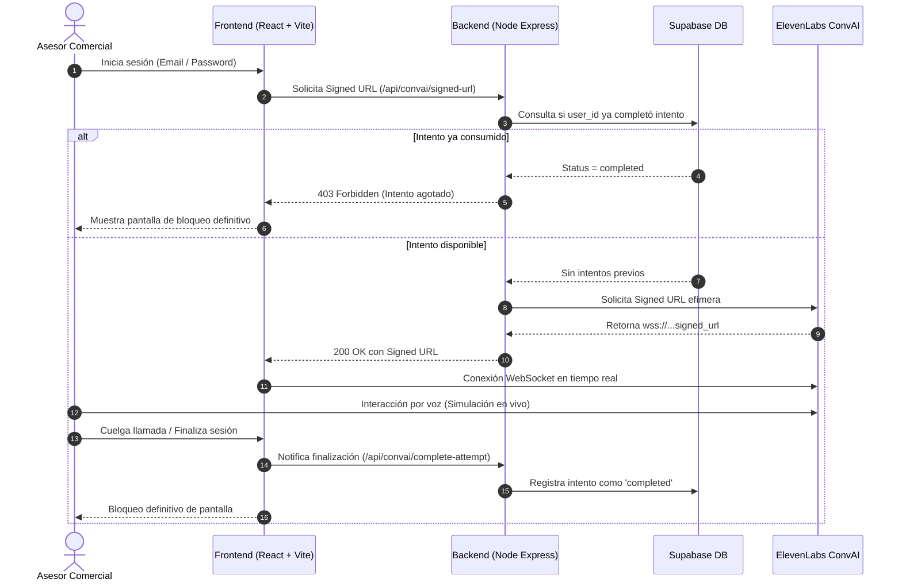

# 🎙️ Sales Training AI — Simulador de Ventas Claro Hogar

Plataforma ejecutiva de entrenamiento y evaluación de habilidades comerciales mediante **agentes conversacionales de voz en tiempo real**, impulsada por **ElevenLabs Conversational AI**, **React 19**, **Three.js** y **Supabase**.

El sistema actúa como un simulador interactivo de cliente residencial exigente de Claro Hogar Colombia, evaluando el sondeo, manejo de objeciones y cierre de ventas bajo una política estricta de **un solo intento por usuario**.

---

## 📸 Arquitectura Visual del Estudio (Cockpit)

La interfaz fue diseñada con una estética minimalista tipo estudio ejecutivo (*Clean Studio*), optimizada para encajar en el 100% de la altura de la pantalla (`100vh`) sin requerir desplazamiento vertical:

```
┌──────────────────────────────────────────────────────────────────────────────────────────────────┐
│  🔴 Sales Training AI [SIMULADOR CLARO]                 👤 Alex Thompson 🔔  [FINALIZAR SIMULACIÓN]│
├──────────────────────────────┬───────────────────────────────────┬───────────────────────────────┤
│    INSTRUCCIONES DEL RETO    │           HERO CENTRAL            │   TRANSCRIPCIÓN EN VIVO       │
│                              │                                   │                               │
│  ❶ Manejo de objeción...    │         [ 3D WebGL Orb ]          │  ┌─────────────────────────┐  │
│  ❷ Presentar beneficios...   │          (Cromo Perla)            │  │ [Tú]             14:31  │  │
│  ❸ Cierre de prueba...       │                                   │  │ Mensaje del asesor...   │  │
│                              │       ılılılılılılılılılılı       │  └─────────────────────────┘  │
│  ┌────────────────────────┐  │       (Onda Audio Bicolor)        │  ┌─────────────────────────┐  │
│  │ Escenario: Migración a │  │                                   │  │ [Cliente]        14:31  │  │
│  │ plan Ilimitado...      │  │        ( 🎤  |  🔴  )             │  │ Objeción del cliente... │  │
│  └────────────────────────┘  │     [Floating Pill Dock]          │  └─────────────────────────┘  │
│                              │                                   │                               │
│  [Empatía] [Escucha Activa]  │  LLAMADA EN VIVO | 02:45          │                               │
│  [Objeciones] [Cierre Ventas]│                                   │                               │
└──────────────────────────────┴───────────────────────────────────┴───────────────────────────────┘
```

---

## 🚀 Características Principales

- **Agente de Voz Neuronal de Ultra-Baja Latencia**: Conexión bidireccional por WebSockets con ElevenLabs Conversational AI.
- **Orb 3D WebGL con Shaders de Cromo Líquido**:
  - Renderizado acelerado por hardware con Three.js.
  - Dinámica de fluidos sensible a los estados de voz (`idle`, `listening`, `talking`, `thinking`).
  - Bisel perimetral de alto contraste optimizado para fondos claros.
- **Visualizador de Onda de Audio Binaural**: Barras armónicas animadas en tiempo real con halo de estudio difuso.
- **Floating Pill Dock**: Control de llamada minimalista con botón de silencio de micrófono y acción rápida de colgar/iniciar.
- **Streaming de Transcripción en Tarjetas Flotantes**: Registro en vivo de la conversación diferenciando intervenciones de `[Tú]` y `[Cliente]`.
- **Garantía Criptográfica de 1 Solo Intento**:
  - Autenticación con Supabase Auth.
  - Backend Express que valida en base de datos si el usuario ya consumió su intento antes de generar una **Signed URL efímera**.
  - Políticas de Seguridad a Nivel de Fila (RLS) en PostgreSQL.

---

## 🛠️ Stack Tecnológico

| Capa | Tecnologías |
|---|---|
| **Frontend** | React 19, Vite, Three.js, `@elevenlabs/react`, Lucide Icons, CSS3 Moderno |
| **Backend** | Node.js, Express, `@supabase/supabase-js`, ElevenLabs REST API |
| **Base de Datos** | PostgreSQL (Supabase), Row Level Security (RLS) |
| **Estilos** | CSS Modular (`src/styles/`), Sin dependencias pesadas de frameworks |

---

## 📋 Requisitos Previos

Antes de ejecutar el proyecto, asegúrate de contar con:

- **Node.js** >= v18.0.0
- **npm** >= v9.0.0
- **Git** >= v2.40.0
- Una cuenta en [Supabase](https://supabase.com) (base de datos y autenticación)
- Una cuenta en [ElevenLabs](https://elevenlabs.io) con acceso a Conversational AI

---

## ⚙️ Configuración Paso a Paso

### 1. Clonar el Repositorio

```bash
git clone https://github.com/bpogscanva-bot/bot-training.git
cd bot-training
```

### 2. Configurar la Base de Datos en Supabase

1. Ve a tu proyecto en [Supabase Dashboard](https://supabase.com/dashboard) y abre el **SQL Editor**.
2. Copia y ejecuta el contenido del script [`supabase/schema.sql`](supabase/schema.sql):

```sql
-- Crea la tabla de intentos únicos
create table if not exists public.user_attempts (
  id uuid primary key default gen_random_uuid(),
  user_id uuid references auth.users(id) on delete cascade not null,
  status text not null check (status in ('in_progress', 'completed')),
  created_at timestamp with time zone default timezone('utc'::text, now()) not null,
  completed_at timestamp with time zone,
  constraint unique_user_attempt unique (user_id)
);

-- Habilita Row Level Security
alter table public.user_attempts enable row level security;
```

---

### 3. Configurar Variables de Entorno

#### Frontend (`.env` en la raíz del proyecto):

Crea un archivo `.env` tomando como base `.env.example`:

```bash
cp .env.example .env
```

Edita `.env` con tus claves de Supabase y el ID del Agente de ElevenLabs:

```env
VITE_SUPABASE_URL=https://TU_PROYECTO.supabase.co
VITE_SUPABASE_ANON_KEY=tu_anon_key_publica_de_supabase
VITE_ELEVENLABS_AGENT_ID=agent_5001m2rf4n4mf0qv7m8xa1p06n9t
```

#### Backend (`server/.env`):

Crea un archivo `server/.env` tomando como base `server/.env.example`:

```bash
cp server/.env.example server/.env
```

Edita `server/.env` con tus credenciales privadas (estas **nunca** deben exponerse en el cliente):

```env
PORT=3001
ELEVENLABS_API_KEY=tu_xi_api_key_de_elevenlabs
ELEVENLABS_AGENT_ID=agent_5001m2rf4n4mf0qv7m8xa1p06n9t
SUPABASE_URL=https://TU_PROYECTO.supabase.co
SUPABASE_SERVICE_ROLE_KEY=tu_service_role_key_secreta_de_supabase
CLIENT_ORIGIN=http://localhost:5173
```

---

### 4. Instalación de Dependencias

Instala los paquetes tanto en el cliente como en el servidor:

```bash
# Dependencias del Frontend
npm install

# Dependencias del Backend
cd server
npm install
cd ..
```

---

## 🏃‍♂️ Ejecución del Entorno de Desarrollo

Se recomienda iniciar ambos servicios en terminales independientes:

### Terminal 1: Backend Microservicio (Puerto 3001)

```bash
npm run server
```

Deberás ver en consola:
```
[Server] Microservicio iniciado en http://localhost:3001
[Server] Conectado a Supabase correctamente.
```

### Terminal 2: Frontend React + Vite (Puerto 5173)

```bash
npm run dev
```

Abre en tu navegador web:
👉 **`http://localhost:5173`**

---

## 🔒 Flujo de Seguridad y Regla de 1 Solo Intento



---

## 📂 Estructura del Código

```text
bot-training/
├── public/                  # Favicon e isotipos vectoriales
├── server/                  # Microservicio Node.js / Express
│   ├── src/
│   │   ├── controllers/     # Controladores (emisión de signed-urls, registro de intentos)
│   │   ├── routes/          # Endpoints de API REST
│   │   ├── server.js        # Configuración de Express, CORS y servidor HTTP
│   │   └── supabase.js      # Cliente de Supabase con service_role
│   ├── .env.example
│   └── package.json
├── src/
│   ├── assets/              # Gráficos estáticos
│   ├── components/
│   │   ├── auth/            # Formulario de autenticación / registro
│   │   └── voice-agent/     # Componentes del simulador
│   │       ├── AgentTelemetry.jsx   # Instrucciones, escenario y rúbrica (Columna Izquierda)
│   │       ├── AttemptCompleted.jsx # Pantalla de bloqueo tras consumir el intento
│   │       ├── CallControls.jsx     # Dock flotante con botones de llamada y silenciar
│   │       ├── LiveWaveform.jsx     # Visualizador de onda de audio con halo de luz
│   │       ├── Orb.jsx              # Esfera 3D WebGL con shaders de Three.js
│   │       ├── TranscriptFeed.jsx   # Streaming de transcripción en tarjetas flotantes
│   │       └── VoiceWidget.jsx      # Orquestador del Cockpit y sesión ElevenLabs
│   ├── hooks/               # Custom hooks (useAuth, useAttemptStatus)
│   ├── lib/                 # Inicialización cliente de Supabase
│   ├── services/            # Llamadas a endpoints del microservicio
│   ├── styles/              # Archivos CSS modulares desacoplados
│   ├── App.jsx              # Ruteo condicional por estado de intento
│   └── main.jsx
├── supabase/
│   └── schema.sql           # Esquema SQL y políticas de seguridad RLS
├── .env.example
├── eslint.config.js
├── package.json
└── vite.config.js
```

---

## 🧪 Scripts Disponibles

En la raíz del proyecto puedes ejecutar:

- `npm run dev`: Inicia el servidor de desarrollo de Vite (`localhost:5173`).
- `npm run build`: Compila y optimiza la aplicación para producción en la carpeta `dist/`.
- `npm run lint`: Ejecuta ESLint para verificar estándares de calidad y buenas prácticas.
- `npm run server`: Inicia el microservicio de backend Express (`localhost:3001`).

---

## 📄 Licencia

Este proyecto es de uso interno y confidencial para entrenamiento comercial de telecomunicaciones. Todos los derechos reservados.
